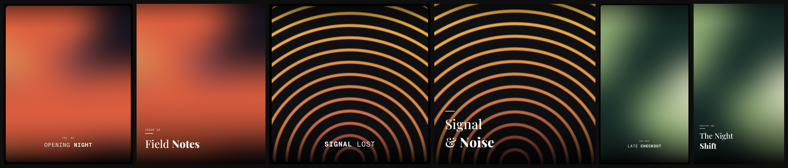
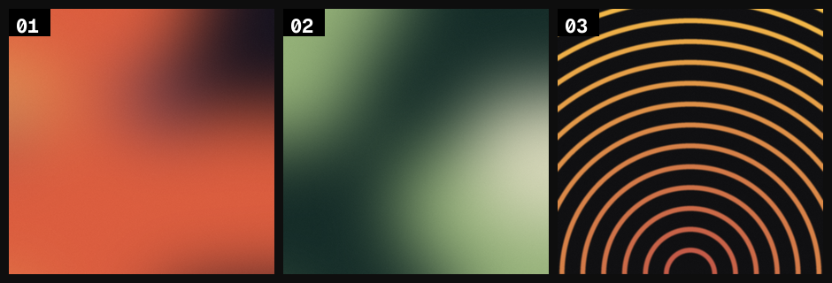

# scrim

**Branded social cards from the command line. One photo in, designed post out.**

[](LICENSE)
[](cardforge.py)
[](#how-it-works)
[](#adding-a-template)



scrim turns a folder of photos into finished social posts: cover-cropped,
faded, and typeset, at feed and story sizes. It is pure Pillow. No browser, no
API, no template DSL. Each template is one readable Python file, so the output
is deterministic and the whole tool runs anywhere Python runs.

## Quickstart

```bash
git clone https://github.com/vcspr/scrim && cd scrim
pip install pillow

python3 cardforge.py examples/demo-dusk.jpg --headline "OPENING **NIGHT**" --kicker "vol. 04"
python3 cardforge.py photo.jpg --template editorial --size 9x16 \
    --headline "The Night | **Shift**" --kicker "Chapter Two"
```

Cards land in `output/`. The demo backgrounds in `examples/` are generated
procedurally by `examples/make_demo_backgrounds.py`, so the repo carries no
stock photography.

## Templates

| | |
|---|---|
| `mono` | Rounded photo card on black. ALL-CAPS letterspaced monospace headline, centered over a bottom fade that stays subtle until it grounds the type. Optional kicker. |
| `editorial` | Full-bleed photo. Left-aligned high-contrast serif with a thin rule and mono kicker. Break lines with `\|`. |

**Markup:** `**word**` renders bold in any template. `--kicker` adds the small
eyebrow line. `--logo path.png` places a wordmark in the top-left safe area.

**Sizes:** `4x5` (1080×1350), `1x1` (1080×1080), `9x16` (1080×1920), `16x9` (1920×1080).

## Batch Curation Workflow

For picking covers out of a large shoot:

```bash
python3 contactsheet.py ./shoot --out sheet.png
```

You get a numbered grid. Pick numbers by eye, then render just those frames.
The sheet order is deterministic (sorted by filename), so number 14 is always
the same image on every run. This human-in-the-loop pattern beats automated
"best frame" scoring for anything brand-sensitive.



## How It Works

- **Cover crop** scales-to-fill and center-crops, like CSS `object-fit: cover`.
- **Scrims** are curve-shaped alpha gradients (`alpha = amax * t^power`). The
  default bottom fade (`0.34` height, `power 2.1`) stays out of the photo's way
  and commits to near-black only at the edge, which is what grounds the type.
- **Type** is drawn character-by-character for real letterspacing, with an
  autofit loop that shrinks the size until the line fits. Bold runs come from
  the variable font's weight axis, not a second font file.
- **Fonts** are vendored variable TTFs under the SIL Open Font License:
  [Geist Mono](fonts/OFL-GeistMono.txt) and
  [Playfair Display](fonts/OFL-PlayfairDisplay.txt).

## Adding a Template

Copy `templates/mono.py`, keep the `render(image_path, out_path, headline, *,
size, kicker, logo)` signature, change the composition. Register it in
`cardforge.py`. If it renders the demo backgrounds cleanly at all four sizes,
it is a template. PRs welcome.

## Roadmap

- [ ] Batch mode: CSV/JSON in, a folder of finished posts out
- [ ] Carousel sets: cover + clean swipe slides from one command
- [ ] Duotone and grid templates
- [ ] Video poster frames (pull the sharpest frame, then render)

## License

[MIT](LICENSE) © 2026 Victor Uwakwe. Fonts under their own
[OFL licenses](fonts/).
